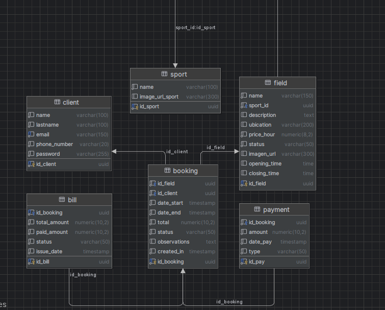

# Sistema de Reservas de Canchas Deportivas

## Stack tecnológico

**Backend**
- Java 17
- Spring Boot 4.0.6
- Spring Security 7 (autenticación stateless con JWT)
- Spring Data JPA + Hibernate 7
- PostgreSQL 15
- jjwt 0.12.3 (generación y validación de tokens)
- Lombok (reducción de boilerplate)
- Bean Validation (jakarta.validation)

**Frontend**
- React 18 (Vite)
- Axios (cliente HTTP con interceptor de autenticación)
- Tailwind CSS
- React Router

---

## Decisiones técnicas principales

**PostgreSQL como base de datos**

Elegí PostgreSQL porque es con el que me siento mas cómodo, desde que comence a trabajar en proyectos mas complejos lo uso y estoy acostumbrado a su sintaxis-
Primeramente desarrolle tota mi base de datos dentro de Datagrip. Posteriormente adapte los datos al proyecto de Springboot
Decidi usar variables en ingles porque en los requisitos decia fields asi que para que no quede diferente segui asi, me di cuenta un poco tarde que pedia que la api se llamase /reservations, me gustaba mas /bookings.
Utilice UUID porque un docente me enseño que era la mejor practica, ya que garantiza una unicidad global sin importar el servidor central que se utilice
En los datos como type_payment, status_bill, status_booking, status_field utilice ENUM porque no tenian tantos valores diferentes como para tener que hacer una tabla aparte.
Esto luego lo tuve que migrar como VARCHAR en el back porque necesitaba ser compatible con Hibernate.

**Foto del Diagrama de Base de Datos hecho en DataGrip**



**Autenticación JWT stateless**
No utilice sesión en el servidor, cada request autenticado incluye un Bearer token en el header authorization. 
El token se genera al registrarse o iniciar sesión y expira en 24 horas. 
El payload incluye el clientId (en UUID) y el email como subject. 
La extracción del cliente en los endpoints protegidos se realiza directamente desde el SecurityContext sin necesidad de consultar la base de datos en el filtro.

**Separación de responsabilidades**
- entity: modelos JPA mapeados a tablas
- repository: interfaces SpringData con queries personalizadas
- service: logica de negocio
- controller: exposición HTTP
- dto: objetos de transferencia de datos (request/response)
- config: seguridad, CORS, JWT

**Pago mínimo del 50%**
Esto fue algo agregado que le di al sistema, para evitar que cualquier persona reserve 5 canchas y se de a la fuga.
La reserva requiere un pago inicial de al menos el 50% del total. 
El total se calcula automaticamente segun las horas reservadas y el precio por hora de la cancha. 
Se genera un registro en payment y una bill asociada con estado paid o partially_paid.

---

## Modelo de datos

### Tablas principales

- sport: deporte asociado a la cancha (nombre, imagen)
- field: cancha deportiva (nombre, deporte, ubicación, precio/hora, horario apertura/cierre, imagen, estado)
- client: usuario del sistema (nombre, apellido, email único, teléfono, password BCrypt)
- booking: reserva (cancha, cliente, fecha inicio, fecha fin, total, estado, observaciones)
- payment: pagos realizados (monto, tipo, fecha, reserva)
- bill: factura por reserva (total, pagado, estado, fecha emisión)
Todo en la db esta en ingles con camelCase

### Enums

- StatusField: available, not_available
- StatusBooking: pending, confirmed, cancelled, completed
- StatusBill: paid, partially_paid, cancelled
- TypePayment: QR, cash

### Relaciones

- Field → Sport (ManyToOne)
- Booking → Field (ManyToOne)
- Booking → Client (ManyToOne)
- Payment → Booking (ManyToOne)
- Bill → Booking (OneToOne)

---

## Endpoints

### Autenticación

| Método | Ruta | Descripción |
|--------|------|-------------|
| POST | /api/auth/register | Registro de cliente. Retorna AuthResponse con token JWT |
| POST | /api/auth/login | Login. Retorna AuthResponse con token JWT |

**AuthResponse:**
```json
{
  "idClient": "uuid",
  "name": "string",
  "lastname": "string",
  "email": "string",
  "phoneNumber": "string",
  "token": "eyJ..."
}
```

### Canchas

| Método | Ruta | Auth | Descripción |
|--------|------|------|-------------|
| GET | /fields | No | Lista todas las canchas |
| GET | /fields/:id | No | Detalle de una cancha |
| GET | /fields/available | No | Solo canchas con estado available |
| GET | /fields/:id/availability | No | Slots ocupados en un rango de fechas |

Parámetros de /fields/:id/availability:
- start (LocalDateTime, requerido)
- end (LocalDateTime, requerido)
- excludeBooking (UUID, opcional — excluye una reserva del cálculo, usado en edición)

### Reservas

| Método | Ruta | Auth | Descripción |
|--------|------|------|-------------|
| GET | /bookings | No | Lista todas las reservas |
| GET | /bookings/my | Sí | Reservas del cliente autenticado |
| GET | /bookings/:id | No | Detalle de una reserva |
| POST | /bookings | Sí | Crear reserva |
| PUT | /bookings/:id | Sí | Editar fechas de una reserva |
| PUT | /bookings/:id/cancel | No | Cancelar una reserva |
| GET | /bookings/:id/payment-status | No | Estado de pago (total, pagado, pendiente) |

**Body POST /bookings:**
```json
{
  "id_field": "uuid",
  "date_start": "2026-05-17T10:00:00",
  "date_end": "2026-05-17T12:00:00",
  "amount": 120.00,
  "type_payment": "QR",
  "observations": "string opcional"
}
```

**Parametros PUT /bookings/:id:**
- dateStart (LocalDateTime, requerido)
- dateEnd (LocalDateTime, requerido)
- amount (BigDecimal, opcional — pago adicional si el nuevo total requiere más)

**BookingResponse:**
```json
{
  "idBooking": "uuid",
  "idField": "uuid",
  "fieldName": "string",
  "idClient": "uuid",
  "clientName": "string",
  "clientEmail": "string",
  "clientPhone": "string",
  "dateStart": "datetime",
  "dateEnd": "datetime",
  "total": 120.00,
  "status": "confirmed",
  "observations": "string",
  "createdIn": "datetime",
  "amount": 60.00,
  "typePayment": "QR"
}
```

---

## Validaciones de negocio

- No se puede reservar una cancha con estado not_available
- No se permiten reservas con solapamiento de horario en la misma cancha (excluyendo canceladas)
- El pago inicial debe ser al menos el 50% del total calculado
- No se puede cancelar una reserva con menos de 1 hora de anticipacion
- No se puede editar una reserva cancelada o que ya inicio
- Al editar, el total se recalcula y la bill se actualiza; si hay pago adicional, se registra un nuevo payment

---

## Configuración y ejecución

### Requisitos

- Java 17
- Maven 3.8+
- PostgreSQL 15 corriendo en localhost:5432

### Base de datos

Crear la base de datos:
```sql
CREATE DATABASE proyecto_canchas;
```

Convertir columnas de ENUM nativo a VARCHAR (necesario si la DB fue creada con tipos ENUM de PostgreSQL):
```sql
ALTER TABLE booking ALTER COLUMN status TYPE VARCHAR(50) USING status::VARCHAR;
ALTER TABLE field ALTER COLUMN status TYPE VARCHAR(50) USING status::VARCHAR;
ALTER TABLE payment ALTER COLUMN type TYPE VARCHAR(50) USING type::VARCHAR;
ALTER TABLE bill ALTER COLUMN status TYPE VARCHAR(50) USING status::VARCHAR;
```

Permitir reservas sin cliente asociado:
```sql
ALTER TABLE booking ALTER COLUMN id_client DROP NOT NULL;
```

### Variables de configuración

Editar src/main/resources/application.properties:
```
spring.datasource.url=jdbc:postgresql://localhost:5432/proyecto_canchas
spring.datasource.username=postgres
spring.datasource.password=tu_password
spring.jpa.hibernate.ddl-auto=validate
```

### Ejecutar el backend

```bash
mvn spring-boot:run
```

El servidor levanta en http://localhost:8080

### Ejecutar el frontend

```bash
cd frontend
npm install
npm run dev
```

El frontend corre en http://localhost:5173 y hace proxy de /api hacia localhost:8080 mediante la configuración de Vite.

---

## Seguridad

- Passwords hasheados con BCrypt (strength default 10)
- Tokens JWT firmados con HMAC-SHA256
- Expiración de token: 24 horas
- Sesión stateless: no hay cookies ni estado en servidor
- CORS configurado para permitir http://localhost:5173 y http://localhost:5174
- Todos los endpoints son accesibles sin autenticación excepto POST /bookings y GET /bookings/my, que requieren Bearer token válido

---

## Estructura del proyecto

```
src/main/java/pyroneta/fields/
├── config/         # SecurityConfig, CorsConfig, JwtUtil, JwtFilter
├── controller/     # AuthController, BookingController, FieldController
├── dto/            # AuthResponse, LoginRequest, RegisterRequest,
│                   # CreateBookingRequest, BookingResponse, BookingPaymentStatusResponse
├── entity/         # Bill, Booking, Client, Field, Payment, Sport
│   └── enums/      # StatusBill, StatusBooking, StatusField, TypePayment
├── repository/     # Interfaces Spring Data JPA
└── service/        # AuthService, BookingService, FieldService
```
