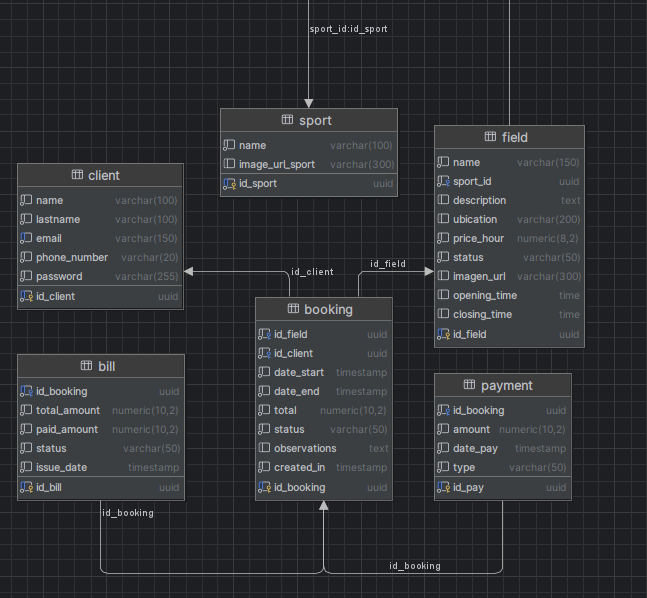

bueno antes de leer todo, siento que tome en cuenta y asumi fallas y validaciones necesarias en un sistema como este mas alla de los requerimientos minimos, no esta del todo completo como me gustaria pero creo que me ajuste bien al tiempo, es mi segunda o tercera vez desplegando algo en vercel asi q es un gran aporte, tambien siento que mis diseños de la pagina podrian haber sido mejores pero no se me ocurria nada que grite "deporte", pero siento que me esforce y use las varias cosas que sé, cualquier pregunta o feedback es bienvenido
psdt: no pegue los comandos de la db porque como ya esta en la db de render creo que se obvia, pero si los necesitan los paso 

OLÉ — Gestión de Reservas de Canchas Deportivas
Stack tecnológico — Backend

Java 17
Spring Boot 4.0.6
Spring Security 7 (autenticación stateless con JWT)
Spring Data JPA + Hibernate 7
PostgreSQL 15
jjwt 0.12.3 (generación y validación de tokens)
Lombok (reducción de boilerplate)
Bean Validation (jakarta.validation)

**Decisiones técnicas principales**
**Springboot como framework**
La verdad tengo poca experiencia con este framework, comence a usarlo hace como un mes porque ahora estamos cursando CERTIFICACION III justo con springboot y pienso re utilizar el sistema que hice para base de datos avanzadas
Y hace como un mes comence a probarlo para ir llevando todo a Springboot
Siento que es completo, me llama bastante la atencion y todo lo que sea Java es bienvenido

**PostgreSQL como base de datos**
Elegi PostgreSQL porque es con el que me siento mas comodo, desde que comence a trabajar en proyectos mas complejos lo uso y estoy acostumbrado a su sintaxis. 
Primero desarrolle toda la base de datos dentro de DataGrip y luego adapté los datos al proyecto de Spring Boot.
Decidi usar variables en inglés porque en los requisitos decía "fields" así que para que no quedara diferente seguí en el mismo idioma. Me di cuenta un poco tarde que pedía que la API se llame /reservations y me gustaba más /bookings.
Usé UUID porque un docente (Ricardo Laredo) me enseñó que era la mejor práctica, ya que garantiza unicidad global sin depender de un servidor central.
Para los estados y tipos de pago (type_payment, status_bill, status_booking, status_field) usé ENUM porque no tenían tantos valores diferentes como para justificar una tabla aparte. Luego tuve que migrarlos a VARCHAR en el backend para que fueran compatibles con el binding de parámetros de Hibernate 6+.
Autenticación JWT stateless
No utilicé sesión en el servidor. Ya había utilizado JWT en un sistema de Sistemas Distribuidos así que lo recicié.
Separación de responsabilidades

entity: modelos JPA mapeados a tablas
repository: interfaces con queries personalizadas
service: lógica de negocio
controller: exposición HTTP
dto: objetos de transferencia de datos
config: seguridad, CORS, JWT

Pago minimo del 50%
Esto fue algo que agregue al sistema para evitar que alguien reserve varias canchas y se dé a la fuga. La reserva requiere un pago inicial de al menos el 50% del total y el total se calcula automaticamente según las horas reservadas y el precio por hora de la cancha. Si una reserva se edita y el nuevo 50% es mayor, se pide que pague la diferencia.

**DB**

sport: sport associated with the field (name, image URL)
field: sports field (name, sport, location, price/hour, opening/closing time, image, status)
client: system user (name, lastname, unique email, phone number, BCrypt password)
booking: reservation (field, client, start date, end date, total, status, observations)
payment: payments made (amount, type, date, booking)
bill: invoice per booking (total amount, paid amount, status, issue date)
Todo en la DB está en inglés con snake_case.
Enums

StatusField: available, not_available
StatusBooking: pending, confirmed, cancelled, completed
StatusBill: paid, partially_paid, cancelled
TypePayment: QR, cash

**Relaciones**

Field → Sport (ManyToOne)
Booking → Field (ManyToOne)
Booking → Client (ManyToOne)
Payment → Booking (ManyToOne)
Bill → Booking (OneToOne)

Endpoints
Autenticación
MétodoRutaDescripciónPOST/api/auth/registerRegistro de cliente. Retorna AuthResponse con token JWTPOST/api/auth/loginLogin. Retorna AuthResponse con token JWT
AuthResponse:
json{
"idClient": "uuid",
"name": "string",
"lastname": "string",
"email": "string",
"phoneNumber": "string",
"token": "eyJ..."
}
Canchas
MétodoRutaAuthDescripciónGET/fieldsNoLista todas las canchasGET/fields/:idNoDetalle de una canchaGET/fields/availableNoSolo canchas con estado availableGET/fields/:id/availabilityNoSlots ocupados en un rango de fechas (excluye canceladas)
Parámetros de /fields/:id/availability:

start (LocalDateTime, requerido)
end (LocalDateTime, requerido)
excludeBooking (UUID, opcional — excluye una reserva del cálculo, usado al editar)

Reservas
MétodoRutaAuthDescripciónGET/bookingsNoLista todas las reservasGET/bookings/mySíReservas del cliente autenticadoGET/bookings/:idNoDetalle de una reservaPOST/bookingsSíCrear reservaPUT/bookings/:idSíEditar fechas de una reservaPUT/bookings/:id/cancelNoCancelar una reservaGET/bookings/:id/payment-statusNoEstado de pago (total, pagado, pendiente)
Body POST /bookings:
json{
"id_field": "uuid",
"date_start": "2026-05-17T10:00:00",
"date_end": "2026-05-17T12:00:00",
"amount": 120.00,
"type_payment": "QR",
"observations": "string opcional"
}
BookingResponse:
json{
"idBooking": "uuid",
"idField": "uuid",
"fieldName": "string",
"idClient": "uuid",
"clientName": "string",
"clientEmail": "string",
"clientPhone": "string",
"dateStart": "datetime",
"dateEnd": "datetime",
"total": 120.00,
"status": "confirmed",
"observations": "string",
"createdIn": "datetime",
"amount": 60.00,
"typePayment": "QR"
}

*Validaciones*

No se puede reservar una cancha con estado not_available
No se permiten reservas con solapamiento de horario en la misma cancha (las canceladas no cuentan)
Al cancelar una reserva, el horario vuelve a quedar disponible automáticamente
El pago inicial debe ser al menos el 50% del total calculado
No se puede cancelar una reserva con menos de 1 hora de anticipación
No se puede editar una reserva cancelada o que ya inició
Al editar, el total se recalcula y la bill se actualiza; si hay pago adicional, se registra un nuevo payment
Al crear la cuenta se necesitan min 6 caracteres

*Por validar :c*
No llegue a validar temas como el numero porque es medio ambiguo si tienes numero de otro pais 
El eliminar reserva solo sirve en pc no en celu porque use el window.confirm() y cuando me di cuenta ya es muy tarde

Variables de entorno
VariableDefault localDATABASE_URLjdbc:postgresql://localhost:5432/proyecto_canchasDATABASE_USERNAMEpostgresDATABASE_PASSWORD—JWT_SECRETfields-secret-key-must-be-at-least-32-chars!!

Ejecutar backend
bashmvn spring-boot:run
El servidor levanta en http://localhost:8080.
esto ya no sirve mucho porque lo desplegue en render y vercel

*Seguridad*

Passwords hasheados con BCrypt 
Tokens JWT firmados con HMAC-SHA256
Expiración de token: 24 horas
Sesión stateless: no hay cookies ni estado en servidor
Los únicos endpoints que requieren autenticación son POST /bookings, PUT /bookings/:id y GET /bookings/my. Esto porque toman el id del cliente desde el token para evitar pasarlo manualmente

**Estructura del proyecto — Backend**
src/main/java/pyroneta/fields/
├── config/         # SecurityConfig, CorsConfig, JwtUtil, JwtFilter
├── controller/     # AuthController, BookingController, FieldController
├── dto/            # AuthResponse, LoginRequest, RegisterRequest,
│                   # CreateBookingRequest, BookingResponse
├── entity/         # Bill, Booking, Client, Field, Payment, Sport
│   └── enums/      # StatusBill, StatusBooking, StatusField, TypePayment
├── repository/     # Interfaces Spring Data JPA
└── service/        # AuthService, BookingService, FieldService

**Stack tecnológico — Frontend**

React 18
Vite 5
React Router v6
Axios 1.x

Decisiones técnicas principales — Frontend
Elegí React porque ya lo venía usando y ya me siento familiarizado. Vite lo preferí sobre el create default de react porque arranca mucho más rápido y el feedback en desarrollo es casi instantaneo
Separé cada página en su propio archivo CSS porque honestamente asi lo siento mas ordenado  .El navbar tiene dos modos: transparente sobre el hero en el inicio, y compacto con hamburger en el resto de paginas, esto lo hice por full estetica
El token JWT se guarda en localStorage bajo la clave cliente. Un interceptor de Axios lo adjunta automáticamente en cada petición autenticada, esto para ahorrar tiempo y mas comodidad al usuario
Para las fechas decidi no usar toISOString() porque convierte a UTC y desplaza la hora guardada, todas las fechas se envían como string local en formato YYYY-MM-DDTHH:MM:00

R*utas*
PathPáginaAuth requerida/Home, carrusel de deportes, este agarra las imagenes de public/images, no le puse a todos imagenes porque no pillaba..
/fieldsLista de canchas con filtros
/fields/:id Detalle de cancha + vista de horarios
/ookings/new?field=:idNueva reserva — calendario + slots
/bookings/new?field=:id&edit=:bookingId Editar reserva existente
/bookings Todas las reservas (esto seria solo del admin pero asumi q todos son admin por tiempo)
/mybookings Mis reservas 
/login Login
/register Registro de nuevo usuario

*Variables de entorno — Frontend*
Crear un archivo .env en la raíz del proyecto frontend:
VITE_API_URL=http://localhost:8080
esto igual ya no importa porque logre exponerlo 

Ejecutar frontend
bashnpm install
npm run dev
La app levanta en http://localhost:5173.

*Estructura del proyecto — Frontend*
src/
├── api/
│   └── axios.js           # Instancia Axios + interceptor de auth + funciones de API
├── components/
│   ├── Navbar.jsx          # Navbar sticky/transparente + drawer lateral
│   └── UserPopup.jsx       # Botón de avatar con dropdown de sesión
├── css/
│   ├── Navbar.css
│   ├── Home.css
│   ├── Fields.css
│   ├── FieldDetail.css
│   ├── NewBooking.css
│   ├── Bookings.css
│   └── MyBookings.css
├── pages/
│   ├── Home.jsx
│   ├── Fields.jsx
│   ├── FieldDetail.jsx
│   ├── NewBooking.jsx
│   ├── Bookings.jsx
│   ├── MyBookings.jsx
│   ├── Login.jsx
│   └── Register.jsx
├── App.jsx                 # Router + rutas
└── main.jsx